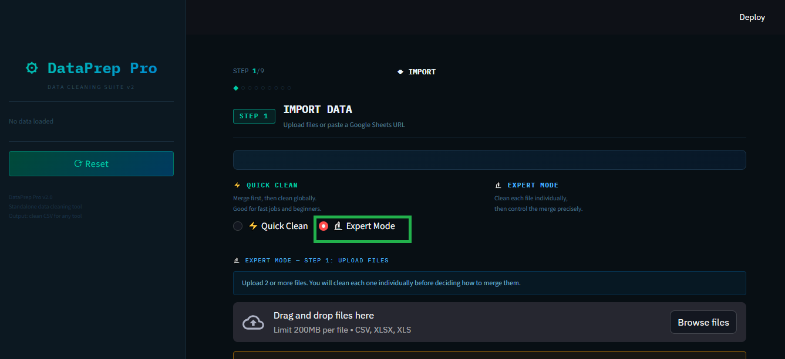
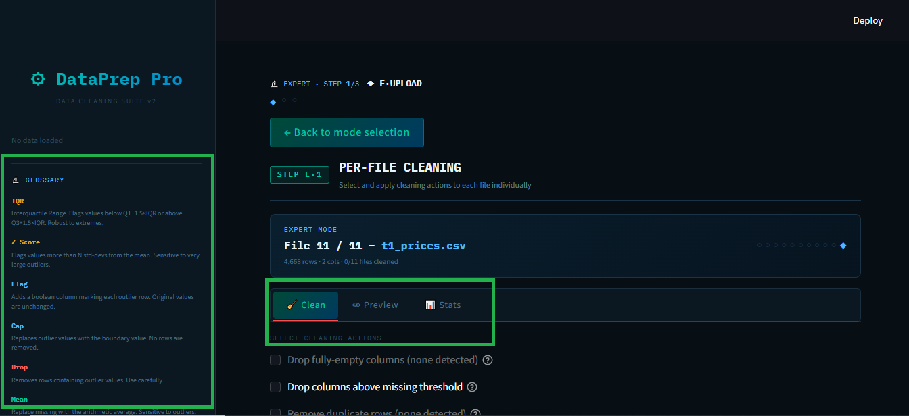
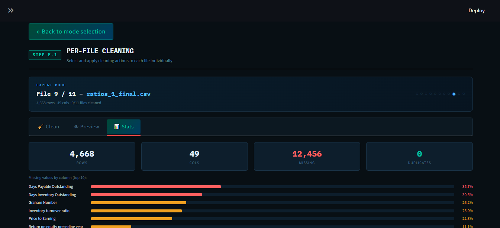

# DataPrep Pro

AI-powered financial data cleaning application.

## 🎯 Purpose
Automatically clean raw financial files (CSV, Excel) and prepare them for analysis.

## ✨ Features
- Multi-file import (up to 11 files simultaneously)
- Preview before merge
- Smart merge (concatenate or join)
- Duplicate detection and removal
- Auto-clean with quality score (35 → 77)
- Full navigation between steps

- ## 🧠 Two Modes for Different Users

### ⚡ Quick Clean (default)
Merge first, then clean globally.  
Ideal for beginners or when you need a fast result.

### 🎯 Expert Mode (NEW)
Clean each file individually, then decide how to merge.  
Full control over every step:
- File‑by‑file cleaning with multiple actions at once
- All cleaning steps visible (duplicates, missing values, outliers, standardization, etc.)
- Actionable suggestions (Apply / Review / Ignore)
- Tooltips & explanations for every option
- Before/after preview for each action
- Step summary after each file
- Manual file navigation (you choose when to move to the next file)

👉 Perfect for professionals who need transparency and control.


*Choose between Quick Clean and Expert Mode*


*Apply multiple actions at once on a single file*


*Suggestions with Apply / Review / Ignore buttons*

## 🛠️ Tech Stack
-


- Pandas
- Claude (AI)


### Main Interface

*Main dashboard of DataPrep Pro*

### File Preview / Merge View

*File preview and merge settings*

## 📬 Connect with me

[](https://linkedin.com/in/othmane-afif-a846713b0)

Feel free to reach out for questions, collaboration, or opportunities!

## 🚀 Installation
```bash
git clone https://github.com/your-username/DataPrep-Pro.git
cd DataPrep-Pro
pip install -r requirements.txt
streamlit run app.py
